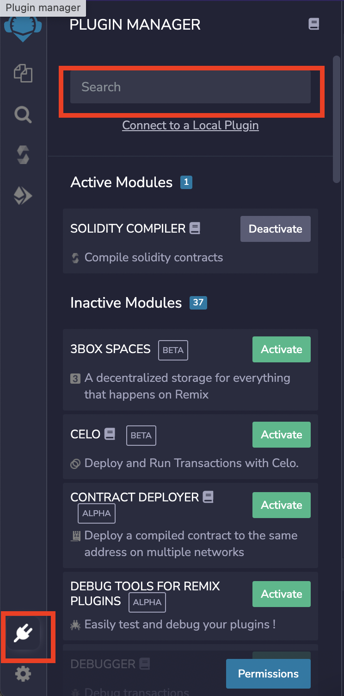
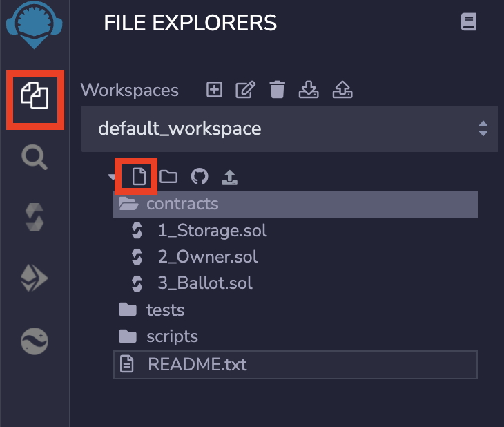
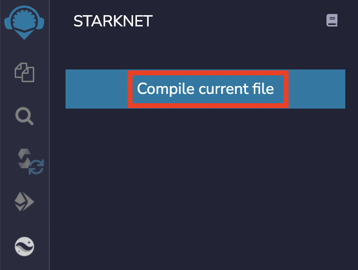
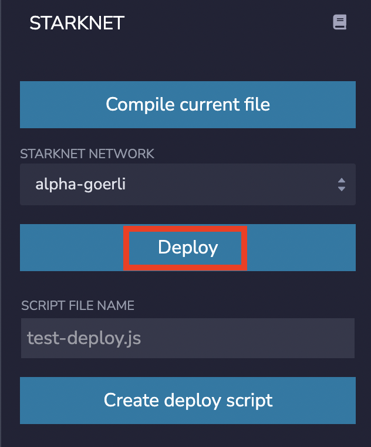

# Remix Game Day
Welcome to the StarkNet puzzle of Remix game day!
## Objective
Your goal is to mint NFT on StarkNet to unlock a clue to the next puzzle.

You have to deploy a specific smart contract that does the following:
1. Has a function `ping()` which answers `Pong` (string, encoded as a felt) when called. You can use [this file](utils.py) to do the required conversions
2. Stores the address of the NFT contract
3. Stores your address, to send the NFT to you after minting
4. Calls the function `mint_from_remix()` to mint an NFT, using both parameters set at 2. and 3.

The NFTs are in contract [0x03e4d98d62f785c00529785c0b0d76cdc3e16129a39b5b54df49880c6b48a40f](https://goerli.voyager.online/contract/0x03e4d98d62f785c00529785c0b0d76cdc3e16129a39b5b54df49880c6b48a40f), deploy on StarkNet Goerli testnet.

## Playing
1. Open [Remix](https://remix.ethereum.org/)
2. Click on the plugin button and search for the StarkNet plugin

3. Create a new file name contract.cairo

4. Copy / paste the code of [this contract](contracts/RemixExampleContract.cairo)
5. Read the contract, and modify it so that it achieves the desired goal
6. Compile the file

7. Deploy the contract

8. Create an [Argent X](https://chrome.google.com/webstore/detail/argent-x/dlcobpjiigpikoobohmabehhmhfoodbb) wallet
9. Go check your contract on Voyager: https://goerli.voyager.online/contract/your-contract-address
10. Use the "read contract" and "write contract" to interact with your contract if needed
11. Check out your NFT on [Oasis](https://testnet.playoasis.xyz/)
